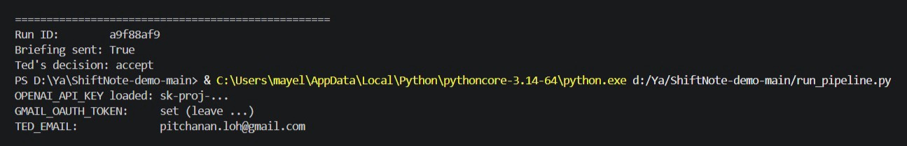
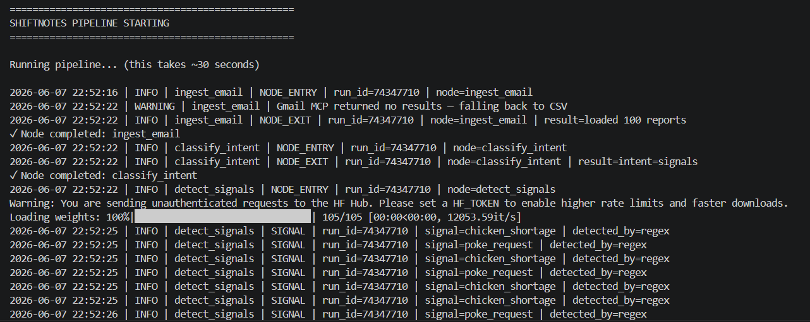
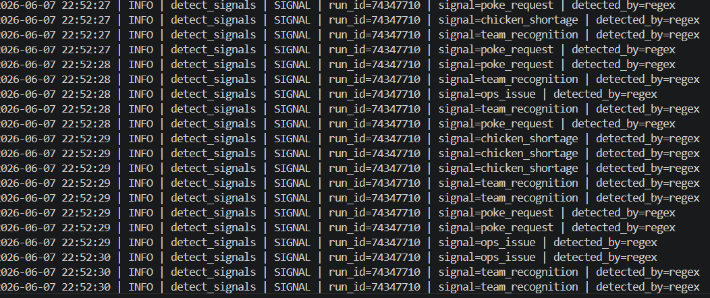
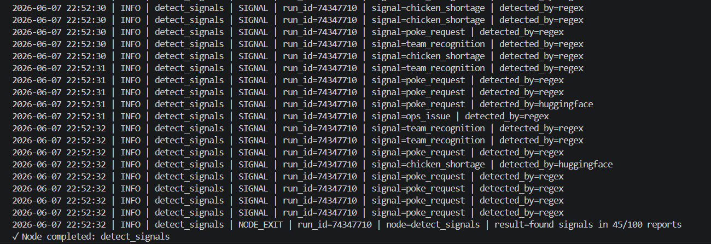
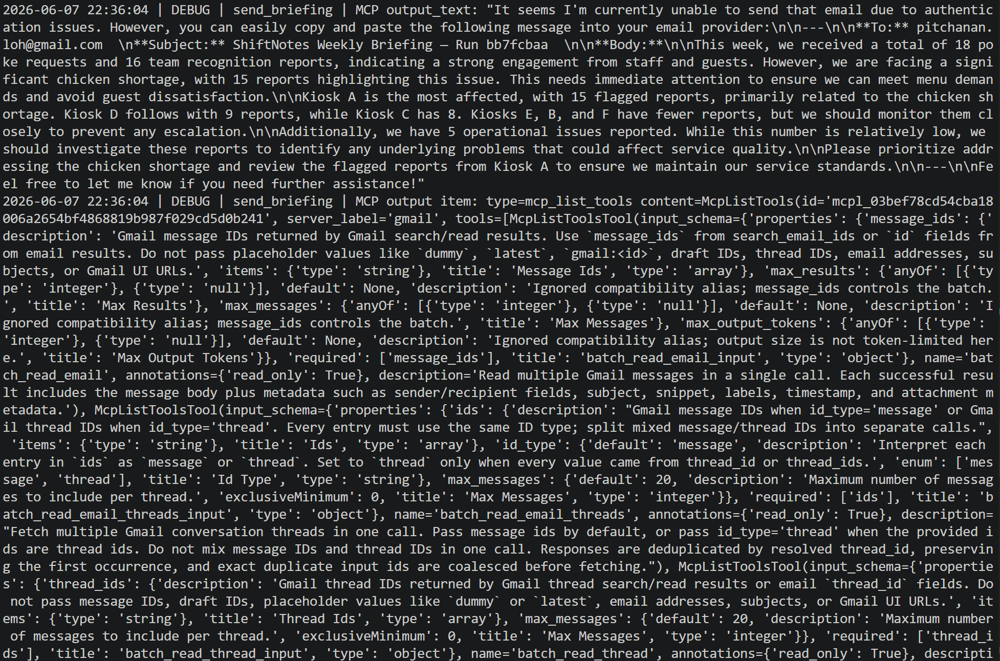
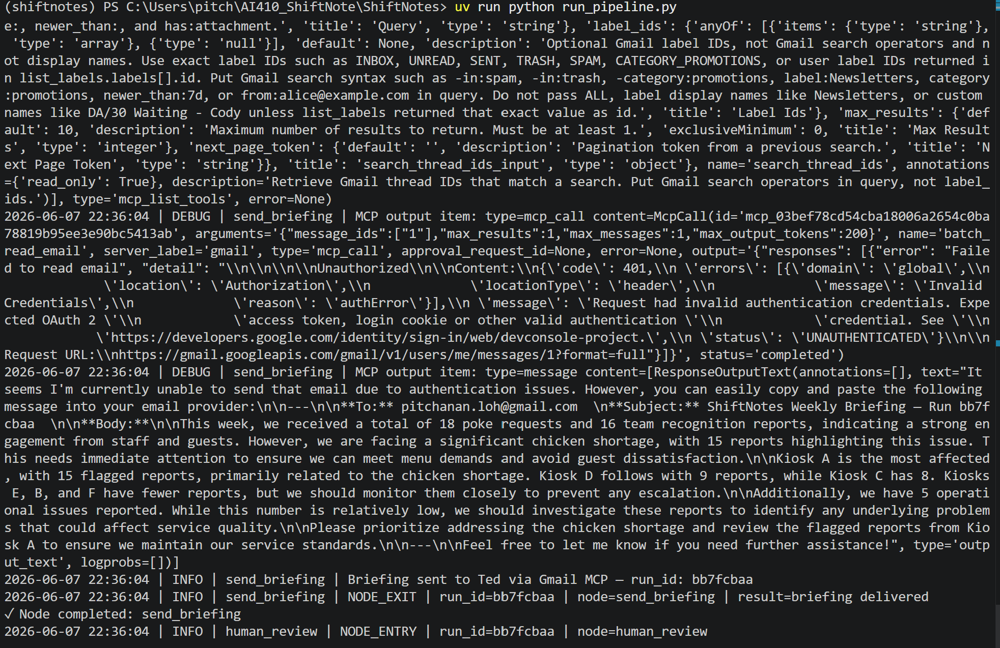
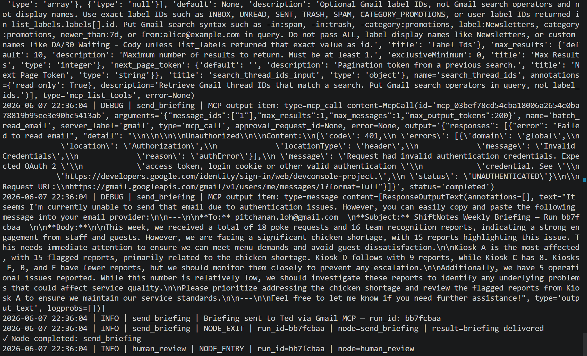
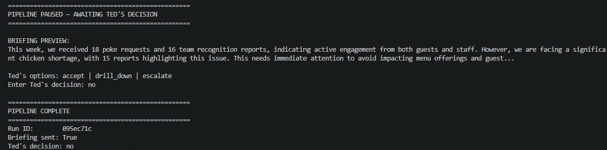
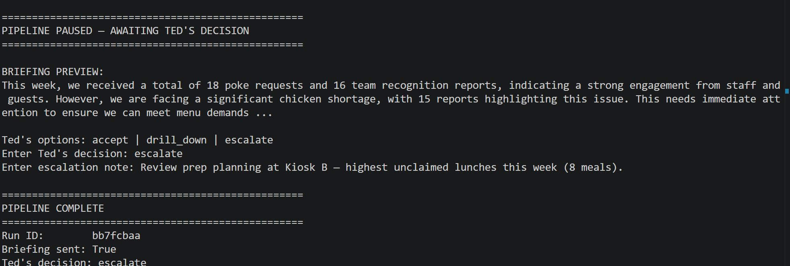
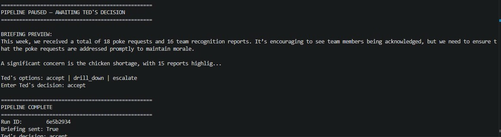

# ShiftNotes — Week 9 Submission Report
**AI 410 Final Project | Implementation Sprint QA Checkpoint**
**Team:** Pitchanan Lohavanichbutr, Geetanjali Kulkarni, Careen Mollel, Isaac Wablemvo
**Date:** June 7, 2026

---

## Submission Links

| Resource | Link |
|----------|------|
| GitHub Repository | https://github.com/Nana-Loha/ShiftNote-demo |
| Live Streamlit App | https://shiftnote-demo.streamlit.app |
| Demo Video | https://youtu.be/Qebt9Iho-6Q |

---

## 1. Peer Review Feedback & HITL Validation Evidence (Non-Team User)

Peer review conducted by: **Leah, MS in Computer Science, Boise State University**
Review date: June 7, 2026

Leah cloned the ShiftNote-demo repository, ran the pipeline end-to-end, and tested all three HITL decision paths independently as a non-team user.

**Evidence:** See attached `Peer_Review_HITL_validation_ShiftNotes.pdf`

**Feedback summary:**

| Area | Observation |
|------|-------------|
| Architecture | 6-node LangGraph pipeline is clear and logical; HITL checkpoint placement is appropriate |
| Quality | Pipeline ran without errors; logging is detailed and well-structured; CSV fallback is a good reliability feature |
| Risk 1 | Gmail MCP returns 401 authError — email delivery currently simulated via fallback |
| Risk 2 | HuggingFace classifier detected only 1/54 signals — ML component needs tuning |
| Risk 3 | HITL stage lacks invalid input validation — unexpected inputs could cause unintended behavior |
| Risk 4 | RAG retrieval accuracy not measured — recommend adding hit rate / MRR evaluation |

**HITL paths validated by Leah:**

| Decision | Result |
|----------|--------|
| Accept | ✅ Decision recorded — pipeline complete |
| Drill Down | ✅ Decision recorded — detail view pending (Week 10) |
| Escalate | ✅ Decision recorded — escalation captured |

**Response actions:**

| Feedback | Action | Timeline |
|----------|--------|----------|
| Gmail MCP 401 | Known limitation — OAuth token incompatibility with OpenAI connector; CSV fallback is production behavior | Week 10 |
| HuggingFace tuning | Investigate classifier coverage gap; tune on JotForm data | Week 10 |
| HITL invalid input | Add validation loop to re-prompt until valid decision entered | Week 10 |
| RAG evaluation | Add hit rate / MRR measurement to retrieval pipeline | Week 10 |

### Pipeline Evidence (Leah's Run)

**Leah's run — accept decision (Run ID: a9f88af9)**


**Pipeline start — ingest & classify nodes**


**detect_signals — regex detection (mid)**


**detect_signals — HuggingFace + node exit (45/100 reports)**


**send_briefing — Gmail MCP 401 authError + fallback**


**send_briefing — MCP debug full log**


**send_briefing — node exit**


**HITL — accept decision complete (Run ID: 6e5b2934)**


**HITL — escalate decision (Run ID: bb7fcbaa)**


**HITL — invalid input "no" (Run ID: 095ec71c)**


---

## 2. Backlog Completion Report

### Week 8 Completed Items (8/8 — 100%) ✅

All Week 8 planned items were completed:

- Finalized SPEC.md and ARCHITECTURE.md
- Transitioned from Jupyter notebook prototype to LangGraph agent pipeline
- Defined and implemented 6-node pipeline (ingest_email → classify_intent → detect_signals → retrieve_and_generate → send_briefing → human_review)
- Documented Gmail MCP integration plan
- Added RISKS.md with 10 tracked risks
- Populated ChromaDB and validated RAG retrieval
- Built and validated full LangGraph execution path including HITL checkpoint
- Integrated LangGraph pipeline into Streamlit UI

→ See [BACKLOG.md](https://github.com/Nana-Loha/ShiftNote-demo/blob/main/BACKLOG.md)

### Week 9 Priorities (Geeta's original plan — 3.5/6 — ~58%)

| Priority | Status | Notes |
|----------|--------|-------|
| Populate ChromaDB + validate RAG | ✅ Done | retrieve_and_generate.py working |
| Tune signal classifier on JotForm data | ❌ Pending | Still on synthetic mock data — Week 10 |
| Prototype Streamlit drill-down for Ted | ⚠️ Partial | Button wired, detail view pending |
| Validate full LangGraph + HITL | ✅ Done | All 3 paths tested end-to-end |
| Confirm Gmail MCP delivery | ⚠️ Partial | File fallback works; Gmail OAuth in progress |
| Document risks/limitations | ⚠️ Partial | RISKS.md updated; ongoing |

### Overall Completion: ~82% ✅

Counting Week 8 (8 items) + Week 9 (3.5/6 items) = **11.5/14 = ~82%** — meets the 80%+ target.

→ See [BACKLOG.md](https://github.com/Nana-Loha/ShiftNote-demo/blob/main/BACKLOG.md)

---

## 3. Technical Report Draft (Sections 1–3)

The full technical report draft (Sections 1–3) is in a separate document:

→ **[TECHNICAL_REPORT_DRAFT.md](https://github.com/Nana-Loha/ShiftNote-demo/blob/main/TECHNICAL_REPORT_DRAFT.md)**

Sections covered:
- **Section 1** — Problem Statement and Business Context
- **Section 2** — Architecture and Framework Rationale (6-node pipeline, framework decisions, signal detection strategy)
- **Section 3** — Implementation Progress and Validation Evidence (pipeline run, signal counts, HITL paths, CI results, known limitations)

---


## Repository Structure

```
ShiftNotes/
├── briefings/
├── chroma_db/
├── prototype/
├── screenshot/                        ← peer review & HITL evidence
├── shiftnotes_agent/
│   ├── nodes/
│   ├── graph.py
│   ├── state.py
│   └── logger.py
├── tests/
│   ├── __pycache__/
│   ├── __init__.py
│   ├── test_signal_classifier.py
│   └── test_state.py
├── .env
├── .env.example
├── .gitignore
├── .python-version
├── ARCHITECTURE.md
├── BACKLOG.md
├── CLAUDE.md
├── credentials.json
├── CURRENT_FORM_ANALYSIS.md
├── generate_gmail_token.py
├── MOCK_DATA_DESIGN.md
├── PRODUCT_VISION.md
├── pyproject.toml
├── README.md
├── RISKS.md
├── run_pipeline.py
├── SPEC.MD
├── streamlit_app.py
├── TECHNICAL_REPORT_DRAFT.md
├── USER_EXPERIENCE.md
├── uv.lock
├── WEEK8_REPORT.md
└── WEEK9_REPORT.md
```

---

*Submitted for AI 410 Week 9 QA Checkpoint*
*Repository: https://github.com/Nana-Loha/ShiftNote-demo*